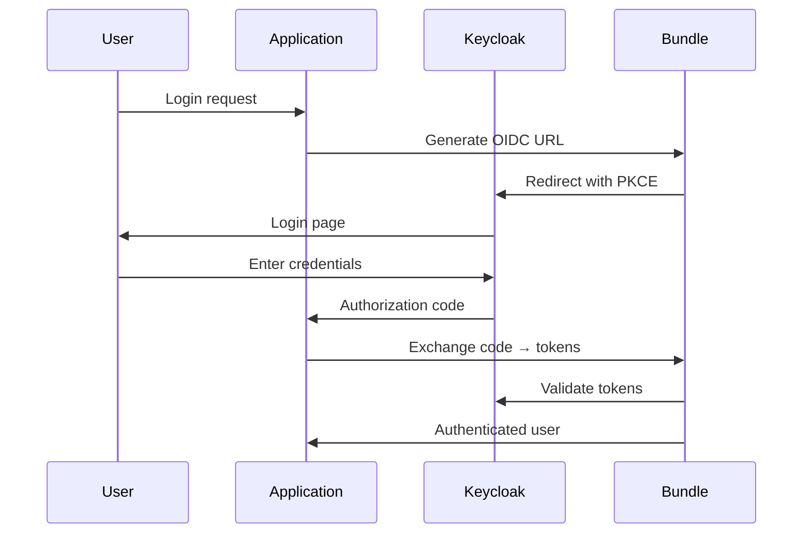

# Complete Documentation for Keycloak Bundle for Symfony

## Table of Contents

1. [Overview](#overview)
2. [Bundle Architecture](#bundle-architecture)
3. [Installation and Configuration](#installation-and-configuration)
4. [Core Services](#core-services)
5. [Security System](#security-system)
6. [Controllers and Routes](#controllers-and-routes)
7. [Practical Usage](#practical-usage)
8. [Advanced Configuration](#advanced-configuration)
9. [Integration Examples](#integration-examples)
10. [Troubleshooting](#troubleshooting)

## Overview

The **Keycloak Bundle for Symfony** (`Zepekegno\KeycloakBundle`) is a complete Keycloak integration solution that provides:

### Core Features

- ✅ **OIDC/OAuth 2.0 Authentication** with PKCE support
- ✅ **JWT Token Validation** with signature verification
- ✅ **User Management** via Keycloak Admin API
- ✅ **Automatic Email Verification** during registration
- ✅ **SSO (Single Sign-On)** multi-platform
- ✅ **Automatic Token Refresh**
- ✅ **Custom Attributes** to identify platforms
- ✅ **Role Management** (realm and client)
- ✅ **Global Logout** Keycloak

### Use Cases

- Web applications with centralized authentication
- JWT-secured REST APIs
- Microservices architecture with SSO
- Multi-platform applications (web, mobile, desktop)
- Systems requiring centralized user management

## Requirements

- PHP: >= 8.0 (bundle minimum); examples in this repository run with PHP >= 8.2 (Symfony 7.3.*)
- Symfony components (required by the bundle):
  - symfony/framework-bundle: ^6.0
  - symfony/security-bundle: ^6.0
  - symfony/http-client: ^6.0
- JWT library:
  - firebase/php-jwt: ^6.0
- Notes:
  - Typical Symfony apps also have ext-ctype and ext-iconv enabled.
  - The sample applications in this repository use Symfony 7.3.* and PHP 8.2.

Minimal install in a Symfony project:
```bash
composer require symfony/framework-bundle symfony/security-bundle symfony/http-client firebase/php-jwt
```

### File Structure

```
KeycloakBundle/
├── config/
│   ├── routes.yaml          # Routes d'authentification
│   └── services.yaml        # Configuration des services
├── src/
│   ├── Controller/
│   │   └── AuthController.php
│   ├── DependencyInjection/
│   │   ├── Configuration.php
│   │   └── KeycloakExtension.php
│   ├── Security/
│   │   ├── JwtAuthenticator.php
│   │   ├── KeycloakAuthenticator.php
│   │   ├── KeycloakUser.php
│   │   └── KeycloakUserProvider.php
│   ├── Service/
│   │   ├── KeycloakAdminService.php
│   │   ├── OIDCService.php
│   │   └── TokenRefreshService.php
│   └── KeycloakBundle.php
└── translations/
    ├── messages.en.yaml
    └── messages.fr.yaml
```

### Authentication Flow



## Installation and Configuration

### 1. Installation

```bash
composer require zepekegno/keycloak-bundle
```

### 2. Bundle Activation

```php
// config/bundles.php
return [
    // ... autres bundles
    Zepekegno\KeycloakBundle\KeycloakBundle::class => ['all' => true],
];
```

### 3. Bundle Configuration

```yaml
# config/packages/keycloak.yaml
keycloak:
    # Paramètres requis
    base_url: '%env(KEYCLOAK_BASE_URL)%'              # Keycloak server base URL
    realm: '%env(KEYCLOAK_REALM)%'                    # Realm name Keycloak
    client_id: '%env(KEYCLOAK_CLIENT_ID)%'            # Public client ID for OIDC
    client_secret: '%env(KEYCLOAK_CLIENT_SECRET)%'    # Client Secret for OIDC
    admin_client_id: '%env(KEYCLOAK_ADMIN_CLIENT_ID)%'        # Admin Client ID for Admin API
    admin_client_secret: '%env(KEYCLOAK_ADMIN_CLIENT_SECRET)%' # Admin Client Secret for Admin API
    public_key: '%env(KEYCLOAK_PUBLIC_KEY)%'          # Realm public key for JWT verification
    scope: null 
    algoritm: RS256				      # JWT signing algorithm
  
    # Paramètres optionnels
    verify_token: true                                # Enable JWT signature verification (default: true)
    user_provider_service: null                       # Custom User Provider Service ID (défaut: null)
    redirect_routes:                                  # Role-based redirection after authentication
        ROLE_ADMIN: 'admin_dashboard'
        ROLE_USER: 'user_dashboard'
        default: '/'
```

### 4. Environment Variables

```bash
# .env
# Keycloak server configuration
KEYCLOAK_BASE_URL=https://your-keycloak.example.com
KEYCLOAK_REALM=your-realm-name

# OIDC Client (user authentication)
KEYCLOAK_CLIENT_ID=your-public-client-id
KEYCLOAK_CLIENT_SECRET=your-client-secret

# Admin API Client (user management)
KEYCLOAK_ADMIN_CLIENT_ID=admin-cli
KEYCLOAK_ADMIN_CLIENT_SECRET=admin-client-secret

# Public key for JWT validation
KEYCLOAK_PUBLIC_KEY="-----BEGIN PUBLIC KEY-----\nYOUR_PUBLIC_KEY_HERE\n-----END PUBLIC KEY-----"
```

### 5. Symfony Security Configuration

```yaml
# config/packages/security.yaml
security:
    providers:
        keycloak_provider:
            id: keycloak.user_provider
  
    firewalls:
        # JWT Authentication for API
        api:
            pattern: ^/api
            stateless: true
            custom_authenticators:
                - Zepekegno\KeycloakBundle\Security\JwtAuthenticator
            provider: keycloak_provider
  
        # OIDC Authentication for web interface
        main:
            pattern: ^/
            provider: keycloak_provider
            custom_authenticators:
                - Zepekegno\KeycloakBundle\Security\KeycloakAuthenticator
  
    access_control:
        - { path: ^/auth, roles: PUBLIC_ACCESS }
        - { path: ^/api/public, roles: PUBLIC_ACCESS }
        - { path: ^/api, roles: ROLE_USER }
        - { path: ^/admin, roles: ROLE_ADMIN }
```

### 6. Routes Configuration

```yaml
# config/routes/keycloak.yaml
keycloak_bundle:
    resource: '@KeycloakBundle/config/routes.yaml'
    prefix: /auth
```

## Core Services

### KeycloakAdminService

Service for user management via Keycloak Admin API.

#### Main Methods

```php
use Zepekegno\KeycloakBundle\Service\KeycloakAdminService;

// Service injection
public function __construct(
    private KeycloakAdminService $keycloakAdminService
) {}

// User creation with custom attributes
$userId = $this->keycloakAdminService->createUser(
    data: [
        'username' => 'john.doe',
        'email' => 'john@example.com',
        'firstName' => 'John',
        'lastName' => 'Doe'
    ],
    realmRoles: ['user'],
    clientRoles: ['app-user'],
    password: 'SecurePassword123!',
    attributes: [
        'platform' => ['web'],
        'registration_source' => ['website']
    ],
    requiredActions: ['VERIFY_EMAIL']
);

// Send verification email
$this->keycloakAdminService->sendVerificationEmail($userId);

// Update user attributes
$this->keycloakAdminService->updateUserAttributes($userId, [
    'last_login_platform' => ['mobile'],
    'preferences' => ['theme:dark', 'lang:en']
]);

// Assign roles
$this->keycloakAdminService->assignRealmRoles($userId, ['premium_user']);
$this->keycloakAdminService->assignClientRoles($userId, 'my-app', ['advanced_features']);
```

### OIDCService

Service for OIDC/OAuth 2.0 authentication with PKCE support.

#### Main Methods

```php
use Zepekegno\KeycloakBundle\Service\OIDCService;

// Service injection
public function __construct(
    private OIDCService $oidcService
) {}

// Generate login URL with PKCE
$codeVerifier = $this->oidcService->generateCodeVerifier();
$state = bin2hex(random_bytes(16));

$loginUrl = $this->oidcService->getLoginUrl(
    codeVerifier: $codeVerifier,
    state: $state,
    additionalParams: [
        'scope' => 'openid email profile',
        'prompt' => 'login', // Force credential input
        'max_age' => 3600    // Max session duration
    ]
);

// Store in session for callback
$session->set('keycloak_code_verifier', $codeVerifier);
$session->set('keycloak_state', $state);

// Exchange authorization code for tokens
$tokens = $this->oidcService->exchangeCode(
    code: $request->get('code'),
    codeVerifier: $session->get('keycloak_code_verifier')
);

// Validate and decode JWT token
$tokenData = $this->oidcService->validateToken($tokens['access_token']);

// Extract Bearer token from request
$bearerToken = $this->oidcService->extractBearerToken($request);

// Global logout URL
$logoutUrl = $this->oidcService->getLogoutUrl(refreshToken: $tokens['refresh_token']);
```

### TokenRefreshService

Service dedicated to token refresh management.

#### Main Methods

```php
use Zepekegno\KeycloakBundle\Service\TokenRefreshService;

// Service injection
public function __construct(
    private TokenRefreshService $tokenRefreshService
) {}

// Check for token near expiration
if ($this->tokenRefreshService->isTokenNearExpiration($session, 300)) {
    // Token expires in less than 5 minutes
    $newTokens = $this->tokenRefreshService->refreshTokens(
        $session->get('keycloak_refresh_token')
    );
  
    // Update tokens in session
    $this->tokenRefreshService->updateSessionTokens($session, $newTokens);
}

// Automatic refresh with error handling
try {
    $refreshedTokens = $this->tokenRefreshService->refreshTokensWithRetry(
        refreshToken: $session->get('keycloak_refresh_token'),
        maxRetries: 3
    );
} catch (\Exception $e) {
    // Redirect to login page on failure
    return $this->redirectToRoute('keycloak_login');
}
```

---

## Security System

### KeycloakUser

Class representing a Keycloak user in the Symfony security system.

#### Properties and Methods

```php
use Zepekegno\KeycloakBundle\Security\KeycloakUser;

// Creating a Keycloak user
$user = new KeycloakUser(
    id: 'keycloak-user-uuid',
    username: 'john.doe',
    email: 'john@example.com',
    roles: ['ROLE_USER', 'ROLE_PREMIUM'],
    attributes: [
        'sub' => 'keycloak-user-uuid',
        'preferred_username' => 'john.doe',
        'email' => 'john@example.com',
        'platform' => 'web',
        'realm_access' => ['roles' => ['user', 'premium']],
        'resource_access' => [
            'my-app' => ['roles' => ['app-user']]
        ]
    ]
);

// Data access
$userId = $user->getId();                    // Keycloak UUID
$email = $user->getEmail();                  // User email
$username = $user->getUsername();            // Username
$roles = $user->getRoles();                  // Symfony roles
$attributes = $user->getAttributes();        // All token attributes
$platform = $user->getAttribute('platform'); // Specific attribute
```

### KeycloakUserProvider

User provider to create `KeycloakUser` objects from tokens.

### Controllers and Routes

### AuthController

Main controller for authentication management.

#### Available Routes

| Route              | Method   | Description          |
| ------------------ | -------- | -------------------- |
| `/auth/login`    | GET      | Redirect to Keycloak |
| `/auth/callback` | GET      | OIDC Callback        |
| `/auth/profile`  | GET      | User profile         |
| `/auth/logout`   | GET/POST | Global logout        |

#### Controller Methods

```php
use Zepekegno\KeycloakBundle\Controller\AuthController;

// Redirect to Keycloak login page
public function login(Request $request): RedirectResponse
{
    $codeVerifier = $this->oidcService->generateCodeVerifier();
    $state = bin2hex(random_bytes(16));
  
    $session = $request->getSession();
    $session->set('keycloak_code_verifier', $codeVerifier);
    $session->set('keycloak_state', $state);
  
    $loginUrl = $this->oidcService->getLoginUrl($codeVerifier, $state, [
        'scope' => 'openid email profile'
    ]);
  
    return new RedirectResponse($loginUrl);
}

// Handle OIDC callback
public function callback(Request $request): RedirectResponse
{
    // Automatically handled by KeycloakAuthenticator
    // Redirects according to configured roles
}

// Display user profile
public function profile(Security $security): JsonResponse
{
    /** @var KeycloakUser $user */
    $user = $security->getUser();
  
    return new JsonResponse([
        'id' => $user->getId(),
        'username' => $user->getUsername(),
        'email' => $user->getEmail(),
        'roles' => $user->getRoles(),
        'attributes' => $user->getAttributes()
    ]);
}

// Global logout
public function logout(Request $request): RedirectResponse
{
    $session = $request->getSession();
    $refreshToken = $session->get('keycloak_refresh_token');
  
    $logoutUrl = $this->oidcService->getLogoutUrl($refreshToken);
  
    $session->invalidate();
  
    return new RedirectResponse($logoutUrl);
}
```

## Practical Usage

### User Registration

```php
// In a registration controller
#[Route('/register', methods: ['POST'])]
public function register(
    Request $request,
    KeycloakAdminService $keycloakAdmin
): JsonResponse {
    $data = json_decode($request->getContent(), true);
  
    try {
        $userId = $keycloakAdmin->createUser(
            data: [
                'username' => $data['username'],
                'email' => $data['email'],
                'firstName' => $data['firstName'],
                'lastName' => $data['lastName']
            ],
            realmRoles: ['user'],
            clientRoles: [],
            password: $data['password'],
            attributes: [
                'platform' => [$data['platform'] ?? 'web'],
                'registration_date' => [date('Y-m-d H:i:s')]
            ],
            requiredActions: ['VERIFY_EMAIL']
        );
  
        // Automatic verification email sending
        $keycloakAdmin->sendVerificationEmail($userId);
  
        return new JsonResponse([
            'success' => true,
            'message' => 'User created. Check your email.',
            'user_id' => $userId
        ]);
  
    } catch (\Exception $e) {
        return new JsonResponse([
            'success' => false,
            'message' => 'Creation error: ' . $e->getMessage()
        ], 400);
    }
}
```

### API Authentication with JWT

```php
// Middleware to verify JWT tokens
#[Route('/api/data', methods: ['GET'])]
public function getData(Security $security): JsonResponse
{
    // User is automatically authenticated by JwtAuthenticator
    /** @var KeycloakUser $user */
    $user = $security->getUser();
  
    // Role verification
    if (!$security->isGranted('ROLE_USER')) {
        return new JsonResponse(['error' => 'Access denied'], 403);
    }
  
    // Access to custom attributes
    $platform = $user->getAttributes()['platform'] ?? 'unknown';
  
    return new JsonResponse([
        'data' => 'Sensitive data',
        'user' => $user->getEmail(),
        'platform' => $platform
    ]);
}
```

### Silent SSO

```php
// SSO verification without user interaction
public function checkSso(OIDCService $oidc, Request $request): JsonResponse
{
    $codeVerifier = $oidc->generateCodeVerifier();
    $state = bin2hex(random_bytes(16));
  
    $ssoUrl = $oidc->getSsoLoginUrl($codeVerifier, $state);
  
    // Storage for callback
    $session = $request->getSession();
    $session->set('keycloak_code_verifier', $codeVerifier);
    $session->set('keycloak_state', $state);
  
    return new JsonResponse([
        'sso_url' => $ssoUrl,
        'method' => 'iframe' // For silent verification
    ]);
}
```

### Token Management with Refresh

```php
// Service to keep tokens up to date
public function ensureValidToken(
    Request $request,
    TokenRefreshService $tokenRefresh
): ?array {
    $session = $request->getSession();
  
    // Check expiration
    if ($tokenRefresh->isTokenNearExpiration($session, 300)) {
        try {
            $refreshToken = $session->get('keycloak_refresh_token');
            $newTokens = $tokenRefresh->refreshTokens($refreshToken);
  
            // Update session
            $tokenRefresh->updateSessionTokens($session, $newTokens);
  
            return $newTokens;
        } catch (\Exception $e) {
            // Invalid refresh token
            $session->invalidate();
            return null;
        }
    }
  
    return [
        'access_token' => $session->get('keycloak_access_token'),
        'refresh_token' => $session->get('keycloak_refresh_token')
    ];
}
```

## Advanced Configuration

### Custom User Provider

```php
// src/Security/CustomUserProvider.php
use Aetherius\KeycloakBundle\Security\KeycloakUser;
use Symfony\Component\Security\Core\User\UserProviderInterface;

class CustomUserProvider implements UserProviderInterface
{
    public function __construct(
        private UserRepository $userRepository
    ) {}
  
    public function loadUserByIdentifier(string $identifier): UserInterface
    {
        // Load local user from database
        $localUser = $this->userRepository->findByKeycloakId($identifier);
  
        if (!$localUser) {
            // Create local user if necessary
            $localUser = $this->createLocalUser($identifier);
        }
  
        // Return enriched user
        return new EnrichedKeycloakUser(
            $localUser,
            $identifier
        );
    }
  
    // ... other required methods
}
```

```yaml
# Configuration to use custom provider
keycloak:
    user_provider_service: 'App\Security\CustomUserProvider'
```

### Event Management

```php
// src/EventListener/AuthenticationListener.php
use Symfony\Component\EventDispatcher\EventSubscriberInterface;
use Symfony\Component\Security\Http\Event\LoginSuccessEvent;

class AuthenticationListener implements EventSubscriberInterface
{
    public static function getSubscribedEvents(): array
    {
        return [
            LoginSuccessEvent::class => 'onLoginSuccess',
        ];
    }
  
    public function onLoginSuccess(LoginSuccessEvent $event): void
    {
        $user = $event->getUser();
  
        if ($user instanceof KeycloakUser) {
            // Custom logic after login
            $this->updateLastLogin($user);
            $this->logUserActivity($user);
        }
    }
}
```

### Multi-Environment Configuration

```yaml
# config/packages/dev/keycloak.yaml
keycloak:
    verify_token: false  # Disable in development
  
# config/packages/prod/keycloak.yaml
keycloak:
    verify_token: true   # Enable in production
```

## Integration Examples

### Mobile Application with API

```php
// API controller for mobile
#[Route('/api/mobile', name: 'api_mobile_')]
class MobileApiController extends AbstractController
{
    #[Route('/login', methods: ['POST'])]
    public function mobileLogin(
        Request $request,
        OIDCService $oidc
    ): JsonResponse {
        $data = json_decode($request->getContent(), true);
  
        // Generate login URL for mobile
        $codeVerifier = $oidc->generateCodeVerifier();
        $state = bin2hex(random_bytes(16));
  
        $loginUrl = $oidc->getLoginUrl($codeVerifier, $state, [
            'scope' => 'openid email profile offline_access',
            'prompt' => 'login'
        ]);
  
        return new JsonResponse([
            'login_url' => $loginUrl,
            'code_verifier' => $codeVerifier,
            'state' => $state
        ]);
    }
  
    #[Route('/token', methods: ['POST'])]
    public function exchangeToken(
        Request $request,
        OIDCService $oidc
    ): JsonResponse {
        $data = json_decode($request->getContent(), true);
  
        try {
            $tokens = $oidc->exchangeCode(
                $data['code'],
                $data['code_verifier']
            );
  
            return new JsonResponse([
                'access_token' => $tokens['access_token'],
                'refresh_token' => $tokens['refresh_token'],
                'expires_in' => $tokens['expires_in']
            ]);
        } catch (\Exception $e) {
            return new JsonResponse([
                'error' => 'invalid_grant',
                'error_description' => $e->getMessage()
            ], 400);
        }
    }
}
```

### Token Validation Middleware

```php
// src/EventListener/TokenValidationListener.php
use Symfony\Component\HttpKernel\Event\RequestEvent;
use Symfony\Component\HttpKernel\Exception\UnauthorizedHttpException;

class TokenValidationListener
{
    public function __construct(
        private OIDCService $oidcService,
        private TokenRefreshService $tokenRefreshService
    ) {}
  
    public function onKernelRequest(RequestEvent $event): void
    {
        $request = $event->getRequest();
  
        // Check only API routes
        if (!str_starts_with($request->getPathInfo(), '/api/')) {
            return;
        }
  
        $token = $this->oidcService->extractBearerToken($request);
        if (!$token) {
            return; // Let authenticator handle
        }
  
        // Token validation
        $tokenData = $this->oidcService->validateToken($token);
        if (!$tokenData) {
            throw new UnauthorizedHttpException('Bearer', 'Invalid token');
        }
  
        // Expiration check
        if (isset($tokenData['exp']) && $tokenData['exp'] < time()) {
            throw new UnauthorizedHttpException('Bearer', 'Token expired');
        }
  
        // Store token data for later use
        $request->attributes->set('token_data', $tokenData);
    }
}
```

## Troubleshooting

### Common Issues

#### 1. Token Validation Error

**Symptom**: `Invalid JWT token`

**Solutions**:

- Check public key in `KEYCLOAK_PUBLIC_KEY`
- Ensure realm is correct
- Verify `verify_token` is configured correctly

```bash
# Retrieve realm public key
curl "$KEYCLOAK_BASE_URL/realms/$KEYCLOAK_REALM/protocol/openid-connect/certs"
```

#### 2. PKCE Error

**Symptom**: `Code verifier missing from session`

**Solutions**:

- Check Symfony session configuration
- Ensure cookies are enabled
- Verify HTTPS configuration in production

#### 3. Redirection Issues

**Symptom**: Redirection loops

**Solutions**:

- Check `redirect_routes` in configuration
- Ensure routes exist
- Verify user roles

#### 4. Admin API Errors

**Symptom**: `Unauthorized` during user creation

**Solutions**:

- Check admin client credentials
- Ensure client has necessary permissions
- Verify admin client roles in Keycloak

### Debug Commands

```bash
# Check bundle configuration
php bin/console debug:config keycloak

# List bundle services
php bin/console debug:container | grep keycloak

# Check routes
php bin/console debug:router | grep keycloak

# Test Keycloak connectivity
curl "$KEYCLOAK_BASE_URL/realms/$KEYCLOAK_REALM/.well-known/openid_configuration"
```

### Useful Logs

```yaml
# config/packages/dev/monolog.yaml
monolog:
    handlers:
        keycloak:
            type: stream
            path: "%kernel.logs_dir%/keycloak.log"
            level: debug
            channels: ["keycloak"]
```

```php
// Usage in services
use Psr\Log\LoggerInterface;

public function __construct(
    private LoggerInterface $logger
) {}

public function someMethod(): void
{
    $this->logger->info('Keycloak operation', [
        'operation' => 'user_creation',
        'user_id' => $userId
    ]);
}
```

## Complete API Reference

### KeycloakAdminService

| Method                        | Parameters                                                                 | Return | Description                            |
| ----------------------------- | -------------------------------------------------------------------------- | ------ | -------------------------------------- |
| `createUser()`              | data, realmRoles, clientRoles, password,<br /> attributes, requiredActions | string | Creates a new user in keycloak         |
| `sendVerificationEmail()`   | userId                                                                     | void   | Sends a verification email to the user |
| `updateUserAttributes()`    | userId, attributes                                                         | void   | Updates attributes                     |
| `assignRolesToUser()`       | userId, roles                                                              | void   | Assigns realm roles to the user        |
| `assignCleintRolesToUser()` | userId, roles                                                             | void   | Assigns client roles to the user       |
| `findUserByEmail()`         | userId                                                                     | array  | Searches for users by email            |
| `updateUserAttributes()`    | userId, attributes                                                         | void   | Update user attributes                |
| `getUser()`                 | userId                                                                     | array  | retreives user information            |
| `getAdminToken()`           | -                                                                          | string | Gets an access token for the admin API |

### OIDCService

| Method                     | Parameters                            | Return       | Description                  |
| -------------------------- | ------------------------------------- | ------------ | ---------------------------- |
| `generateCodeVerifier()` | length                                | string       | Generates PKCE code verifier |
| `getLoginUrl()`          | codeVerifier, state, additionalParams | string       | Login URL                    |
| `getSsoLoginUrl()`       | codeVerifier, state                   | string       | Silent SSO URL               |
| `exchangeCode()`         | code, codeVerifier                    | array        | Exchange code → tokens      |
| `validateToken()`        | token                                 | array\|null  | Validates and decodes JWT    |
| `extractBearerToken()`   | request                               | string\|null | Extracts Bearer token        |
| `getLogoutUrl()`         | idToken, redirectUri                  | string       | Logout URL                   |

### TokenRefreshService

| Method                       | Parameters               | Return | Description            |
| ---------------------------- | ------------------------ | ------ | ---------------------- |
| `isTokenNearExpiration()`  | session, marginSeconds   | bool   | Checks near expiration |
| `isTokenExpired()`         | session                  | bool   | Checks expiration      |
| `refreshTokens()`          | refreshToken             | array  | Refreshes tokens       |
| `updateSessionTokens()`    | session, tokens          | void   | Updates session        |
| `refreshTokensWithRetry()` | refreshToken, maxRetries | array  | Refreshes with retry   |

### License

This bundle is licensed under the MIT License. See the [LICENSE](LICENSE) file for details.

### Contributing

1. Fork the project
2. Create a feature branch (`git checkout -b feature/amazing-feature`)
3. Commit your changes (`git commit -m 'Add amazing feature'`)
4. Push to the branch (`git push origin feature/amazing-feature`)
5. Open a Pull Request

### Development Setup

```bash
# Clone the repository
git clone https://github.com/zepekegno224/keycloakBundle.git
cd keycloakBundle

# Install dependencies
composer install

# Run tests
php bin/phpunit

# Check code style
php bin/php-cs-fixer fix --dry-run
```

### Support

For questions or issues:

- Email: moussatraore158@gmail.com
- Issues: [GitHub Issues](https://github.com/zepekegno224/keycloakBundle/issues)
- Documentation: [Wiki](https://github.com/zepekegno224/keycloakBundle/wiki)
- Discussions: [GitHub Discussions](https://github.com/zepekegno224/keycloakBundle/discussions)

## Full Setup Guide

For a step-by-step integration with Symfony (installation, configuration, security, routes, examples), see docs/SETUP.md.

## Wiki

For detailed usage guides, security setup (Web and API), services documentation, and troubleshooting, see docs/wiki/Home.md.
